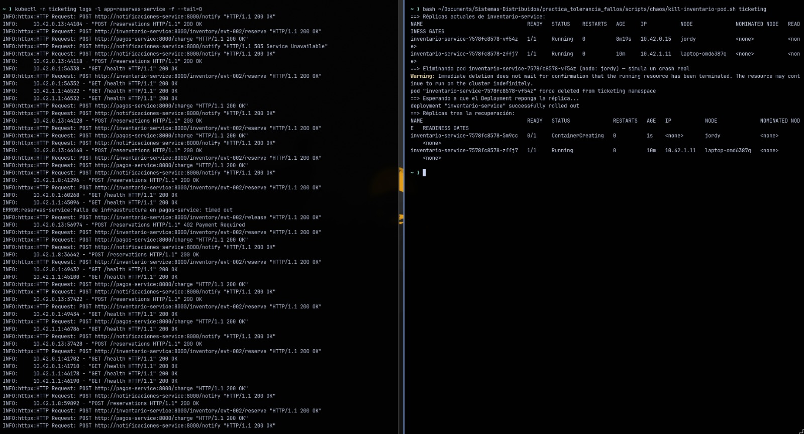
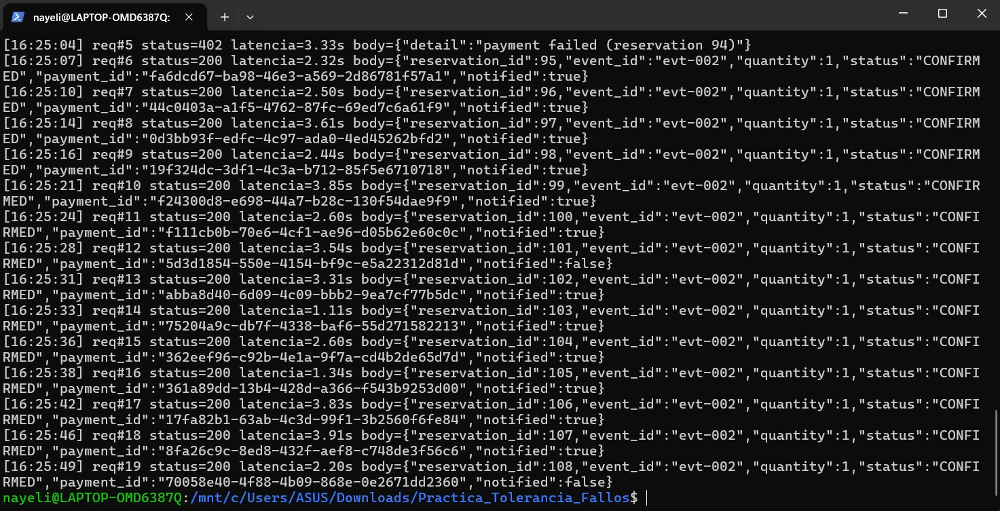
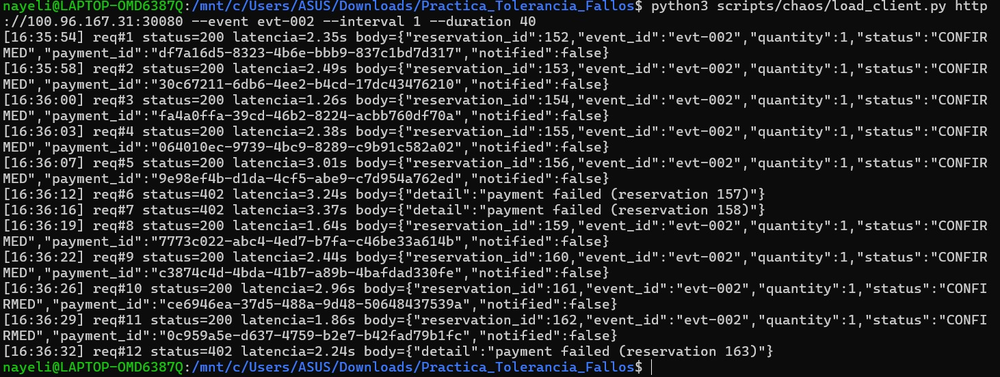
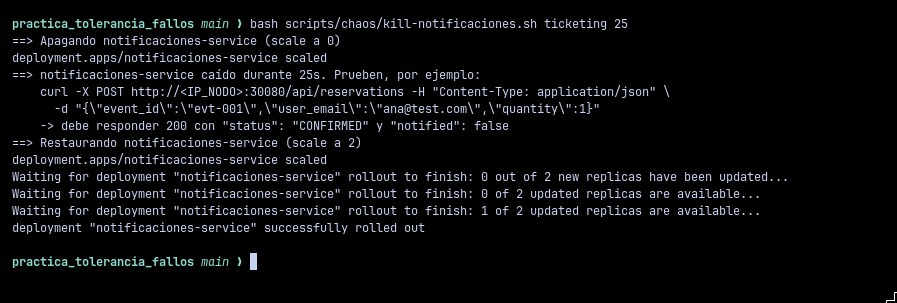
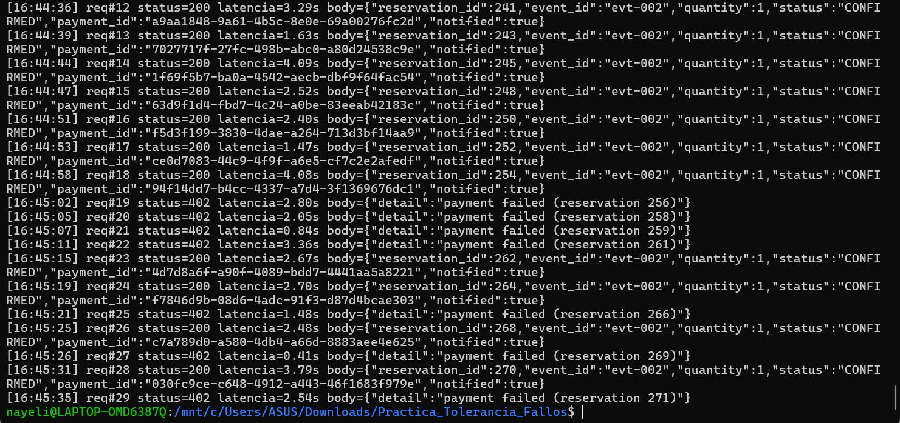
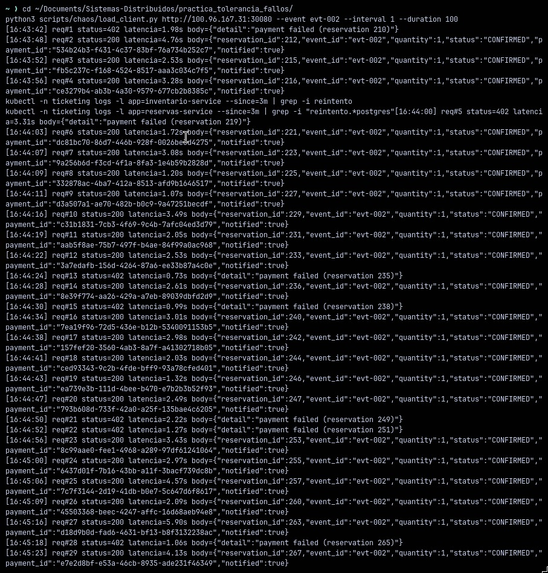
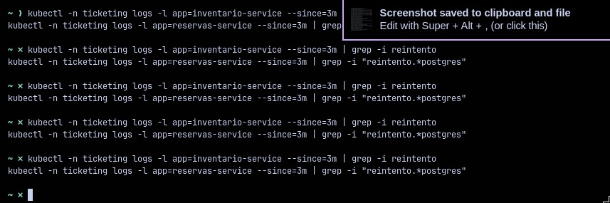

# Práctica de Tolerancia a Fallos — Sistema de Reservas de Entradas

**Integrantes:** Nayeli Barbecho · Jordy Romero

Sistema de venta de entradas de 6 componentes (API Gateway, Reservas, Inventario,
Pagos-stub, Notificaciones-stub, PostgreSQL) desplegado sobre un clúster Kubernetes
**real** de 2 nodos físicos (k3s) — no dos contenedores en una sola máquina — con
`reservas-service` e `inventario-service` repartidos con 2 réplicas, una por nodo,
mediante `podAntiAffinity` obligatoria. Sobre esa infraestructura se implementaron y
demostraron en vivo 4 mecanismos de resiliencia (Circuit Breaker, Retry con backoff ×2,
Fallback) frente a fallos inyectados realmente en el clúster.

Este README es el único documento del repositorio: reúne la arquitectura (Parte I), el
catálogo de fallos (Parte II), los mecanismos implementados (Parte III), los resultados
de las demos en vivo (Parte IV) y el proceso real de despliegue con sus decisiones e
inconvenientes. El análisis teórico de los 2 fallos **no** implementados está aparte, en
[`docs/informe_fallos_no_implementados.docx`](docs/informe_fallos_no_implementados.docx).

---

## Índice

1. [Arquitectura](#1-arquitectura)
2. [Estructura del repositorio](#2-estructura-del-repositorio)
3. [Cómo desplegar](#3-cómo-desplegar)
4. [Proceso real, decisiones e inconvenientes encontrados](#4-proceso-real-decisiones-e-inconvenientes-encontrados)
5. [Parte II — Catálogo de fallos](#5-parte-ii--catálogo-de-fallos)
6. [Parte III — Mecanismos de resiliencia implementados](#6-parte-iii--mecanismos-de-resiliencia-implementados)
7. [Parte IV — Demos en vivo](#7-parte-iv--demos-en-vivo)
8. [Fallos no implementados](#8-fallos-no-implementados)
9. [Limitaciones conocidas](#9-limitaciones-conocidas)

---

## 1. Arquitectura

Diagrama: [docs/architecture.svg](docs/architecture.svg)

| Componente | Rol | Réplicas | Distribución |
|---|---|---|---|
| `api-gateway` | Punto de entrada REST para clientes | 2 | 1 en Nodo A, 1 en Nodo B (anti-affinity preferida) |
| `reservas-service` | Orquesta la compra (Core) | 2 | 1 en Nodo A, 1 en Nodo B (anti-affinity **requerida**) |
| `inventario-service` | Verifica/descuenta cupo disponible | 2 | 1 en Nodo A, 1 en Nodo B (anti-affinity **requerida**) |
| `pagos-service` | Stub de pasarela de pago | 2 | ambas réplicas preferentemente repartidas |
| `notificaciones-service` | Stub de envío de confirmaciones | 2 | ambas réplicas preferentemente repartidas |
| `postgres` | Persistencia compartida (`inventory`, `reservations`) | 1 | fijado a Nodo A por el PVC (`local-path`) |

`reservas-service` e `inventario-service` usan `podAntiAffinity` con
`requiredDuringSchedulingIgnoredDuringExecution` y `topologyKey: kubernetes.io/hostname`,
de forma que Kubernetes **rechaza** programar las 2 réplicas en el mismo nodo. Con
exactamente 2 nodos en el clúster, esto garantiza 1 réplica por nodo: la caída de
cualquiera de las dos computadoras deja al menos una réplica viva de ambos servicios
críticos.

### Flujo de una reserva (REST)

1. Cliente → `api-gateway` (`POST /api/reservations`).
2. `api-gateway` → `reservas-service` (`POST /reservations`).
3. `reservas-service` → `inventario-service` (`POST /inventory/{event_id}/reserve`):
   descuenta el cupo de forma atómica (`UPDATE ... WHERE available_seats >= qty`).
4. `reservas-service` → `pagos-service` (`POST /charge`): stub con latencia aleatoria
   (100–2500 ms, 5% de "colgadas" de 8s) y ~20% de rechazo.
   - Si el pago falla, `reservas-service` compensa liberando el cupo reservado en el
     paso 3 (patrón saga) y persiste la reserva como `FAILED`.
5. Si el pago es exitoso, se persiste la reserva como `CONFIRMED` en PostgreSQL.
6. `reservas-service` → `notificaciones-service` (`POST /notify`): stub con latencia
   aleatoria (50–1500 ms) y ~15% de fallo. Un fallo aquí **no revierte** la reserva ya
   cobrada; solo queda `notified: false`.

### Por qué dos nodos físicos y no un solo clúster de un nodo

El objetivo de la práctica es experimentar con fallos reales de infraestructura (caída
de un nodo completo). Repartir `reservas-service` e `inventario-service` entre dos
computadoras distintas permite apagar una de ellas y verificar que el sistema sigue
respondiendo con la réplica que sobrevive en la otra, algo que un clúster de un solo
nodo no puede demostrar.

---

## 2. Estructura del repositorio

```
services/
  api-gateway/            # punto de entrada REST
  reservas-service/       # Core: orquesta inventario + pagos + notificaciones
                          # (Circuit Breaker, Retry+backoff, Fallback)
  inventario-service/     # cupo por evento, persistido en Postgres (Retry+backoff)
  pagos-service/          # stub con latencia y fallos aleatorios
  notificaciones-service/ # stub con latencia y fallos aleatorios
db/init.sql               # esquema + datos semilla (eventos)
k8s/                      # manifiestos de Kubernetes de la arquitectura base
k8s/chaos/                # recursos usados solo para inyectar fallos (Toxiproxy)
docker-compose.yml        # para probar todo localmente antes de ir a k8s
scripts/                  # build & push de imágenes
scripts/chaos/            # scripts de inyección de fallos + cliente de carga
docs/architecture.svg     # diagrama de arquitectura
docs/informe_fallos_no_implementados.docx   # análisis teórico de los 2 fallos restantes
evidence/                 # capturas de las demos (no versionado por defecto)
```

---

## 3. Cómo desplegar

### 3.1 Prueba rápida en local (sin Kubernetes)

Sirve para validar que la lógica de negocio funciona antes de pelear con la
infraestructura de dos nodos.

```bash
docker compose up --build
```

```bash
curl http://localhost:8000/api/events/evt-001
curl -X POST http://localhost:8000/api/reservations \
  -H "Content-Type: application/json" \
  -d '{"event_id":"evt-001","user_email":"ana@test.com","quantity":2}'
curl http://localhost:8000/api/reservations/1
```

Repitiendo el `POST` varias veces se observan casos `402 payment declined` y
`503`/lentitud provenientes del stub de pagos — es esperado, simula un proveedor real.

### 3.2 Levantar el clúster real de 2 nodos (k3s)

Requisitos: dos computadoras, una con Linux (nativo o VM) y otra con Windows + WSL2,
que puedan alcanzarse por IP entre sí.

**Si ambas están en la misma red local (LAN/WiFi)**, se pueden usar directamente las
IPs de esa red y saltar a 3.2.2. **Si están en redes distintas** (como en nuestro caso —
dos casas distintas), hace falta una malla VPN tipo Tailscale primero; ver
[3.2.1](#321-si-las-dos-máquinas-no-comparten-red-tailscale).

#### 3.2.1 Si las dos máquinas no comparten red (Tailscale)

1. Instalar Tailscale en ambas máquinas (https://tailscale.com/download). En la de
   Windows, además, instalarlo **también dentro de WSL2** (`curl -fsSL
   https://tailscale.com/install.sh | sh` dentro de la distro) — el Tailscale del host
   Windows no es visible desde la red interna de WSL2, así que WSL2 necesita su propia
   instancia para que el agente de k3s pueda usarla.
2. **Las dos máquinas deben quedar como miembros plenos de la misma tailnet**, no como
   "dispositivo compartido" entre tailnets separadas. Usar **Invite external users**
   desde `https://login.tailscale.com/admin/users` (no "compartir dispositivo") y que
   el invitado acepte, sea aprobado por el admin, y recién ahí corra `tailscale login`
   en su máquina. Verificar en `https://login.tailscale.com/admin/machines` que ambos
   dispositivos aparecen sin ninguna etiqueta "Shared in".
3. **Desactivar "Shields Up"** en ambas máquinas (bloquea conexiones entrantes de otros
   peers, rompe el tráfico pod-a-pod aunque el `ping` de Tailscale siga funcionando):
   ```bash
   sudo tailscale set --shields-up=false
   ```
4. **En la máquina Windows, activar el modo de red "mirrored" de WSL2** (el modo NAT
   por defecto de WSL2 tiene un límite de MTU efectivo bajo que rompe handshakes
   TLS/paquetes TCP medianos-grandes). Crear/editar `%UserProfile%\.wslconfig`:
   ```ini
   [wsl2]
   networkingMode=mirrored
   ```
   y reiniciar WSL (`wsl --shutdown` desde PowerShell, después volver a abrir la
   distro).
5. Si persisten cuelgues en handshakes TLS grandes, forzar un MSS más chico en las
   conexiones salientes:
   ```bash
   sudo iptables -t mangle -A OUTPUT -p tcp --tcp-flags SYN,RST SYN -j TCPMSS --set-mss 1180
   sudo iptables -t mangle -A FORWARD -p tcp --tcp-flags SYN,RST SYN -j TCPMSS --set-mss 1180
   ```
   Estas reglas no sobreviven un reinicio de WSL — para que persistan, agregar un
   `command=` en la sección `[boot]` de `/etc/wsl.conf` (dentro de la distro):
   ```ini
   [boot]
   systemd=true
   command="iptables -t mangle -A OUTPUT -p tcp --tcp-flags SYN,RST SYN -j TCPMSS --set-mss 1180; iptables -t mangle -A FORWARD -p tcp --tcp-flags SYN,RST SYN -j TCPMSS --set-mss 1180"
   ```

Con eso, las dos máquinas deberían verse entre sí igual que si estuvieran en la misma
LAN — seguir con 3.2.2 usando las IPs de Tailscale (`100.x.y.z`) en vez de IPs de LAN.

#### 3.2.2 Nodo servidor — en la computadora Linux

```bash
curl -sfL https://get.k3s.io | sh -s - --node-ip=<IP_PROPIA> --flannel-iface=<INTERFAZ>
sudo cat /var/lib/rancher/k3s/server/node-token   # guardar este token
```
`--node-ip`/`--flannel-iface` solo son necesarios si se usa Tailscale — con ambas
máquinas en la misma LAN alcanza con `curl -sfL https://get.k3s.io | sh -`. Con
Tailscale, `<IP_PROPIA>` es la IP `100.x.y.z` de esta máquina y `<INTERFAZ>` es
`tailscale0`.

#### 3.2.3 Nodo agente — en la computadora Windows (dentro de WSL2)

Instalar una distro Linux en WSL2 si no existe (`wsl --install`) y, dentro de esa
terminal Linux:

```bash
curl -sfL https://get.k3s.io | \
  K3S_URL=https://<IP_DEL_NODO_LINUX>:6443 \
  K3S_TOKEN=<TOKEN_COPIADO_EN_3.2.2> \
  sh -s - --node-ip=<IP_PROPIA> --flannel-iface=<INTERFAZ>
```

En LAN, abrir en el firewall de Windows los puertos usados por k3s/flannel si no
conectan: **6443/tcp** (API server), **8472/udp** (VXLAN de flannel) y **30080/tcp**
(NodePort del API Gateway). Con Tailscale estos puertos ya quedan accesibles entre los
peers de la tailnet sin tocar el firewall de Windows (sí puede hacer falta abrirlos en
el firewall **de Linux** si tiene uno activo, ej. `ufw allow 8472/udp`).

#### 3.2.4 Verificar el clúster

Desde el nodo Linux (o copiando `/etc/rancher/k3s/k3s.yaml` — reemplazando
`127.0.0.1` por la IP del nodo servidor — a `~/.kube/config` en la máquina desde la que
se administre):

```bash
kubectl get nodes -o wide
```

Debe listar **2 nodos** en estado `Ready` (uno Linux, uno Windows/WSL2).

> **Nota:** cada `k3s-uninstall.sh` / `k3s-agent-uninstall.sh` borra por completo el
> estado del clúster (namespace, deployments, certificados) y genera un token nuevo —
> después de reinstalar hay que volver a aplicar todos los manifiestos (sección 3.4) y
> usar el token/kubeconfig actualizados.

### 3.3 Construir y publicar las imágenes

Como los pods se ejecutan en dos máquinas físicas distintas, no alcanza con
`docker build` local: cada nodo necesita poder descargar (`pull`) la imagen desde un
registry accesible por ambos (Docker Hub, o cualquier registry propio en la misma red).
Requiere una cuenta gratuita en Docker Hub.

```bash
docker login
./scripts/build-and-push.sh <tu-usuario-dockerhub>
```

(En PowerShell: `./scripts/build-and-push.ps1 -Registry <tu-usuario-dockerhub>`)

Esto construye y sube las 5 imágenes, y genera `k8s/generated/*.yaml` con el
placeholder `__REGISTRY__` ya reemplazado por tu usuario.

### 3.4 Desplegar en el clúster

```bash
kubectl apply -f k8s/generated/00-namespace.yaml
kubectl apply -f k8s/generated/
```

Verificar que las réplicas de los servicios críticos quedaron una en cada nodo:

```bash
kubectl -n ticketing get pods -o wide
```

La columna `NODE` debe mostrar, para `reservas-service` e `inventario-service`, un pod
en cada uno de los dos nodos (si ambos cayeran en el mismo nodo, el pod restante
quedaría `Pending`: eso indicaría que el `podAntiAffinity` no se está respetando o que
falta un nodo `Ready`).

### 3.5 Probar el sistema desplegado

```bash
GATEWAY_IP=<IP_DE_CUALQUIERA_DE_LOS_2_NODOS>
curl http://$GATEWAY_IP:30080/api/events/evt-001
curl -X POST http://$GATEWAY_IP:30080/api/reservations \
  -H "Content-Type: application/json" \
  -d '{"event_id":"evt-001","user_email":"ana@test.com","quantity":2}'
```

Como el `Service` de `api-gateway` es `NodePort`, responde tanto si se apunta a la IP
del nodo Linux como a la del nodo Windows, independientemente de en cuál de los dos
esté corriendo el pod que atiende la petición.

---

## 4. Proceso real, decisiones e inconvenientes encontrados

Esta sección documenta lo que realmente pasó al desplegar sobre 2 computadoras físicas
en redes distintas — es la parte más relevante del trabajo de infraestructura, porque
casi ningún obstáculo fue el que se anticipaba al principio.

**Decisión inicial — Tailscale en vez de LAN.** Las dos computadoras del equipo están en
domicilios distintos, así que la Parte I no se pudo resolver con IPs de red local. Se
eligió Tailscale (malla WireGuard) por ser gratuito, simple de instalar en Linux y
Windows/WSL2, y por no requerir abrir puertos manualmente en cada router.

**Obstáculo 1 — el agente de k3s no encontraba la interfaz de Tailscale.** El primer
intento de unir el nodo Windows falló con `"node IP not found in the host's network
interfaces"`. Causa: Tailscale corría solo en el host Windows, no dentro de la propia
WSL2 (son espacios de red distintos) — el agente de k3s, corriendo dentro de WSL2, no
podía usar una interfaz que solo existía en Windows. Solución: instalar Tailscale
**también dentro de la distro de WSL2**, con su propia identidad de dispositivo.

**Obstáculo 2 — VXLAN cruzaba de nodo pero nunca llegaba.** Con el backend por defecto
de Flannel (`vxlan`), el tráfico pod-a-pod entre nodos salía correctamente por
`tailscale0` de un lado pero nunca se veía llegar del otro (confirmado con `tcpdump` en
ambos nodos simultáneamente). Se probó, en orden: (a) forzar la interfaz de Flannel
manualmente, (b) desactivar el offload de checksum del `flannel.1` (`ethtool -K
flannel.1 tx-checksum-ip-generic off`) — bug conocido de VXLAN sobre túneles
WireGuard —, (c) cambiar el backend a `host-gw` — descartado porque enrutaba por la
interfaz física (WiFi) en vez de por `tailscale0`, algo aún peor —, y (d) cambiar a
`wireguard-native` de Flannel — descartado porque generó conflictos con el propio túnel
WireGuard de Tailscale, llegando a romper hasta la conectividad básica al API server
(puerto 6443) que antes funcionaba sin problema.

**Obstáculo 3 — la causa real: dispositivo "compartido" en vez de miembro de la
tailnet.** Investigando por qué hasta el tráfico más simple era inestable, se encontró
que la invitación inicial había dejado el dispositivo de un integrante como **"Shared
in"** (compartido entre tailnets distintas) en vez de miembro pleno de la misma
tailnet — un modo con más limitaciones para tráfico de rutas/subredes complejas como el
de Flannel. Se corrigió invitando de nuevo como miembro, aprobando la solicitud, y
hacienda `tailscale logout` + `tailscale login` **después** de la aprobación (si se
loguea antes de ser aprobado, el cliente se reconecta solo a su propia tailnet
preexistente sin avisar).

**Obstáculo 4 — Shields Up.** Incluso ya en la misma tailnet, algunas conexiones
seguían sin llegar. Los logs de `tailscaled` (`rejected due to shields`) confirmaron que
uno de los dispositivos tenía activada la opción "Block incoming connections" — bloquea
todo tráfico entrante iniciado por otro peer, pero **no** bloquea el `tailscale ping`
(que usa el protocolo de descubrimiento, no una conexión real), lo cual generó
diagnósticos engañosos durante un buen rato ("si el ping anda, la red anda"). Se
desactivó con `tailscale set --shields-up=false` en ambos dispositivos.

**Obstáculo 5 — MTU bajo del modo NAT de WSL2.** Resuelto lo anterior, seguía fallando
específicamente el tráfico con payloads medianos/grandes (handshakes TLS con
certificado de cliente, por ejemplo) mientras que paquetes chicos (ping, SYN) pasaban
siempre. Se aisló con capturas de `tcpdump`: el handshake avanzaba hasta el mensaje de
certificado del servidor y ahí se cortaba. La causa fue el modo de red NAT por defecto
de WSL2, con un límite de MTU efectivo bajo en su interfaz principal. Se resolvió
activando el modo `networkingMode=mirrored` de WSL2 (elimina la capa de NAT/switch
virtual), reforzado con un `TCPMSS` clamp a 1180 para casos límite.

**Resultado:** una vez resueltos estos 5 obstáculos (en ese orden), el clúster de 2
nodos sobre redes distintas quedó estable, y las 4 demos de la Parte IV corrieron sin
intervención manual adicional más allá de reintentos puntuales por reinicios normales
de las máquinas de cada integrante.

**Inconvenientes menores** (no bloquearon el trabajo, pero vale registrarlos): un
archivo llamado literalmente `nul` (typeo de redirección de Windows) impedía `git add .`
porque `nul` es un nombre reservado en ese sistema operativo; y `kubectl` con
certificado de cliente contra el nodo remoto resultó menos confiable que administrar el
clúster directamente desde el nodo servidor (ver [Limitaciones conocidas](#9-limitaciones-conocidas)).

---

## 5. Parte II — Catálogo de fallos

| # | Fallo | Categoría | Mecanismo técnico de inyección sobre el clúster de 2 nodos |
|---|---|---|---|
| 1 | El Inventario Fantasma | Disponibilidad | `kubectl delete pod` sobre una de las 2 réplicas de `inventario-service` (`--grace-period=0 --force` para simular un crash, no un desalojo ordenado) mientras hay reservas en curso |
| 2 | La Pasarela Lenta | Latencia | El propio stub de `pagos-service` ya simula latencia/timeouts configurables; se fuerza el 100% de las peticiones a tardar ~20s vía `kubectl set env deployment/pagos-service TIMEOUT_RATE=1 SLOW_TIMEOUT_MS=20000` |
| 3 | El Diluvio de Peticiones | Sobrecarga | Generador de carga externo (k6/JMeter, o el `load_client.py` de este repo a mayor frecuencia) apuntando al NodePort `:30080` del API Gateway |
| 4 | Base de Datos Intermitente | Conectividad | k3s usa Flannel por defecto, que **no aplica NetworkPolicies**, así que se optó por un sidecar **Toxiproxy** delante de Postgres que corta/restablece la conexión (`enabled: false/true`) en ciclos vía su API HTTP |
| 5 | El Correo Perdido | Fallo no crítico | `kubectl scale deployment/notificaciones-service --replicas=0` |
| 6 | Condición de Carrera | Consistencia | Múltiples clientes concurrentes (hilos/asyncio o k6 con VUs simultáneos) contra `POST /api/reservations` sobre un evento con 1 solo asiento disponible |

De los 6, se eligieron **4** para implementar mecanismo de defensa + inyección real +
evidencia:

1. El Inventario Fantasma → **Retry con backoff**
2. La Pasarela Lenta → **Circuit Breaker**
3. El Correo Perdido → **Fallback**
4. Base de Datos Intermitente → **Retry con backoff** (a nivel de conexión a Postgres)

Quedan fuera de esta entrega (documentados y con análisis teórico completo en
[docs/informe_fallos_no_implementados.docx](docs/informe_fallos_no_implementados.docx),
pero sin mecanismo implementado): **El Diluvio de Peticiones** (requeriría
Bulkhead/rate-limiting + `metrics-server`/HPA, descartado por el riesgo de
inestabilidad en un clúster mixto Linux + WSL2) y **Condición de Carrera** (ya resuelta
de raíz en la Parte I mediante el `UPDATE ... WHERE available_seats >= qty` atómico de
`inventario-service`, sin patrón nuevo que justificara ocupar uno de los 4 cupos).

---

## 6. Parte III — Mecanismos de resiliencia implementados

| Fallo | Patrón | Por qué ese y no otro |
|---|---|---|
| Inventario Fantasma | **Retry con backoff** (solo ante `httpx.ConnectError`) | El problema es la caída de *una* réplica, no una sobrecarga sostenida — no hace falta un Circuit Breaker. Un Bulkhead tampoco aplica: no hay recursos compartidos que aislar. Reintentar aprovecha directamente que la Service de k8s ya balancea contra la réplica del otro nodo. Se limita a errores de conexión (nunca a timeouts de lectura) porque la operación decrementa cupo y **no es idempotente**: reintentar una petición que sí llegó a aplicarse duplicaría el descuento. |
| La Pasarela Lenta | **Circuit Breaker** | Un retry aquí sería contraproducente: si la pasarela está degradada, reintentar multiplica la carga sobre un servicio ya lento y cada intento vuelve a pagar el costo completo del timeout. El Circuit Breaker deja de llamar a Pagos apenas detecta fallos sostenidos, respondiendo rápido (fail-fast) mientras dura la degradación, y prueba sola la recuperación (half-open) pasado un tiempo. |
| El Correo Perdido | **Fallback** | Es, por definición, un fallo no crítico: la reserva ya está pagada y confirmada. Ni Circuit Breaker ni Bulkhead agregan valor aquí — lo único que importa es no revertir una compra válida por un problema en un servicio secundario. Se agregó un reintento corto (2 intentos) por si el fallo es transitorio, y si persiste, se degrada explícitamente (`notified: false`) sin bloquear al usuario. |
| Base de Datos Intermitente | **Retry con backoff** + descarte de conexiones rotas del pool | El "flapping" es, por definición, transitorio (la conexión vuelve sola en segundos). Un Circuit Breaker no tiene sentido para la propia base de datos del servicio: si abre, el servicio queda inutilizable por completo. El backoff exponencial evita bombardear una base ya inestable con reconexiones inmediatas, y descartar del pool la conexión que falló evita que el siguiente intento reutilice una conexión ya muerta. |

### 6.1 Inventario Fantasma — Retry con backoff

**Código:** [`services/reservas-service/app/main.py`](services/reservas-service/app/main.py)
— función `_post_inventario` (decorada con `tenacity.retry`, `stop_after_attempt(3)`,
`wait_exponential`, `retry_if_exception_type(httpx.ConnectError)`).

**Inyección:** [`scripts/chaos/kill-inventario-pod.sh`](scripts/chaos/kill-inventario-pod.sh)
borra una de las 2 réplicas mientras corre `load_client.py` en paralelo.

**Evidencia a capturar:**
```bash
kubectl -n ticketing get pods -l app=inventario-service -o wide   # antes y después
kubectl -n ticketing logs -l app=reservas-service --since=2m | grep -i "reintento\|inventario"
```

### 6.2 La Pasarela Lenta — Circuit Breaker

**Código:** mismo archivo — `pagos_breaker` (`pybreaker.CircuitBreaker`, `fail_max=3`,
`reset_timeout=30`, `exclude=[PaymentDeclined]`) envolviendo `_charge()`, con
`_BreakerLogger` para dejar constancia de cada transición de estado.

**Inyección:** [`scripts/chaos/slow-payment-gateway.sh`](scripts/chaos/slow-payment-gateway.sh).

**Evidencia a capturar:**
```bash
kubectl -n ticketing logs -l app=reservas-service -f | grep -i breaker
```

**Limitación conocida:** el estado del breaker es local a cada proceso; con 2 réplicas
de `reservas-service` cada una lleva su propio conteo de fallos (no hay un estado
compartido tipo Redis). Para esta práctica es aceptable — en producción se compartiría
el estado entre réplicas.

### 6.3 El Correo Perdido — Fallback

**Código:** mismo archivo — `_post_notify()` (retry corto de 2 intentos) y el bloque
`try/except` en `create_reservation()` que marca `notified=False` sin lanzar excepción
ni revertir la reserva ya persistida como `CONFIRMED`.

**Inyección:** [`scripts/chaos/kill-notificaciones.sh`](scripts/chaos/kill-notificaciones.sh).

**Evidencia a capturar:** una petición `POST /api/reservations` exitosa (`200`,
`status: CONFIRMED`) con `notified: false` mientras `notificaciones-service` está en 0
réplicas.

### 6.4 Base de Datos Intermitente — Retry con backoff

**Código:** [`services/inventario-service/app/main.py`](services/inventario-service/app/main.py)
y [`services/reservas-service/app/main.py`](services/reservas-service/app/main.py) —
decorador `db_retry` (`stop_after_attempt(4)`, `wait_exponential`,
`retry_if_exception_type(psycopg2.OperationalError)`) sobre todas las funciones que
tocan Postgres, y `get_conn()` descartando (`close=True`) la conexión cuando falla.

**Inyección:** [`scripts/chaos/flap-database.sh`](scripts/chaos/flap-database.sh)
(Toxiproxy) + [`restore-database.sh`](scripts/chaos/restore-database.sh) para volver al
estado normal.

**Evidencia a capturar:**
```bash
kubectl -n ticketing logs -l app=inventario-service --since=3m | grep -i "reintento"
kubectl -n ticketing logs -l app=reservas-service --since=3m | grep -i "reintento.*postgres"
```

---

## 7. Parte IV — Demos en vivo

Las 4 demos se corrieron en vivo sobre el clúster real de 2 nodos, generando tráfico
real con [`scripts/chaos/load_client.py`](scripts/chaos/load_client.py) desde la
terminal de un integrante en paralelo al script de inyección corrido por el otro, con
logs en vivo (`kubectl logs -f`) capturados simultáneamente.

| Demo | Patrón | Resultado |
|---|---|---|
| Inventario Fantasma | Retry con backoff | Pod muerto y repuesto en ~10s; sin impacto visible en el cliente (0 errores durante la corrida) |
| Pasarela Lenta | Circuit Breaker | Ciclo completo `closed → open → half-open → open` documentado en logs, con caída de latencia de ~3.3s a ~0.2s tras la apertura |
| Correo Perdido | Fallback | 12/12 reservas confirmadas con `notified:false` durante la caída total de `notificaciones-service`; cero impacto en la venta |
| Base de Datos Intermitente | Retry con backoff | Decenas de reintentos activos en ambos servicios; algunas fallas controladas (502/503/500, nunca cuelgues) cuando el corte (5s) superó el presupuesto acumulado de reintentos (~4.5s) — resultado esperado y documentado, no un fallo del mecanismo |

### 7.1 Demo 1 — El Inventario Fantasma

**Comando de inyección:** `bash scripts/chaos/kill-inventario-pod.sh ticketing`

**Qué se observó:** el pod de `inventario-service` en uno de los nodos fue eliminado a
la fuerza; el Deployment lo repuso en ~10s; durante la ventana de caída, el tráfico
generado por `load_client.py` no mostró impacto (0 errores en la corrida limpia final).

>**Demo 1:**




### 7.2 Demo 2 — La Pasarela Lenta

**Comando de inyección:** `bash scripts/chaos/slow-payment-gateway.sh ticketing 60 20000`

**Qué se observó:** la latencia de las peticiones cayó de ~3.2-3.4s (breaker cerrado,
esperando el timeout completo) a ~0.13-0.32s apenas el breaker abrió tras 3 fallos
consecutivos; los logs mostraron explícitamente las transiciones `closed -> open`,
`open -> half-open` y `half-open -> open` (duplicadas, una por cada réplica de
`reservas-service`, ya que cada una mantiene su propio estado).

> **Demo 2:**




### 7.3 Demo 3 — El Correo Perdido

**Comando de inyección:** `bash scripts/chaos/kill-notificaciones.sh ticketing 25`

**Qué se observó:** con `notificaciones-service` en 0 réplicas durante 25s, las 12
reservas confirmadas en esa ventana devolvieron `"status":"CONFIRMED"` con
`"notified":false` — ninguna compra se vio afectada por la caída del servicio no
crítico.

> **Demo 3:** 



### 7.4 Demo 4 — Base de Datos Intermitente

**Comando de inyección:** `bash scripts/chaos/flap-database.sh ticketing 6 5 10`

**Qué se observó:** durante los 6 ciclos de corte (5s caído / 10s arriba), aparecieron
decenas de líneas `reintento 1/2/3 tras corte de conexión a Postgres` en ambos
servicios; algunas peticiones del cliente sí devolvieron errores controlados
(502/503/500) cuando el corte superó el presupuesto acumulado de reintentos (~4.5s vs.
5s de corte) — nunca un cuelgue, y la mayoría de las peticiones se recuperaron solas.

> **Demo 4:** 





---

## 8. Fallos no implementados

Análisis teórico riguroso (teorema CAP/PACELC, teoría de colas, niveles de aislamiento
ANSI SQL), propuesta de solución de nivel producción y pseudocódigo/diagrama para **El
Diluvio de Peticiones** y **Condición de Carrera**:
[docs/informe_fallos_no_implementados.docx](docs/informe_fallos_no_implementados.docx).

---

## 9. Limitaciones conocidas

- **`kubectl` remoto con certificado de cliente sobre Tailscale**: en nuestra
  configuración, administrar el clúster con `kubectl` desde la máquina que *no* es el
  servidor (autenticando con el certificado de cliente del kubeconfig) resultó menos
  confiable que ejecutar `kubectl`/`k3s kubectl` **localmente en el nodo servidor**
  (donde no hay red de por medio). Para evitar depender de esa conexión remota, en la
  práctica administramos el clúster (`apply`, `get pods`, etc.) desde el nodo Linux
  directamente.

- **`postgres` corre con una sola réplica**; su volumen (`local-path` de k3s) queda
  fijado al nodo donde se programó el pod la primera vez, por lo que la caída de ese
  nodo específico deja la base de datos no disponible hasta que vuelva. Es un punto de
  partida documentado, con propuesta de solución de nivel producción para el caso
  análogo en [docs/informe_fallos_no_implementados.docx](docs/informe_fallos_no_implementados.docx).
